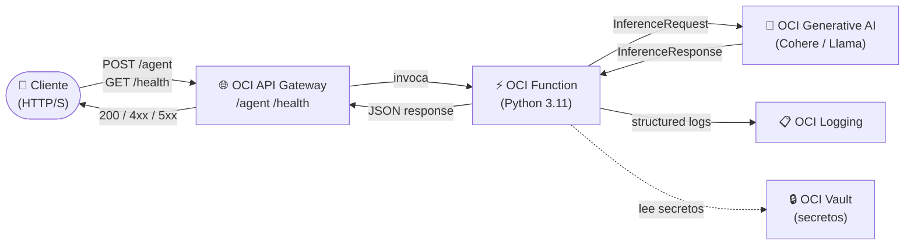

# 🤖 Agente de IA en OCI

[](https://github.com/jorge2026/agente-ia-oci/actions/workflows/ci.yml)
[](https://github.com/jorge2026/agente-ia-oci/actions/workflows/ci.yml)
[](LICENSE)
[](https://www.python.org/downloads/release/python-3110/)
[](https://docs.oracle.com/en-us/iaas/Content/Functions/Concepts/functionsoverview.htm)
[](https://docs.oracle.com/en-us/iaas/Content/generative-ai/overview.htm)

> Agente conversacional serverless desplegado en **Oracle Cloud Infrastructure** usando **API Gateway + OCI Functions** y como modelo de lenguaje **OCI Generative AI** (Cohere / Meta Llama). Acepta peticiones HTTP, orquesta llamadas al LLM y devuelve respuestas JSON estructuradas.

---

## 📐 Arquitectura



### Componentes

| Componente | Servicio OCI | Descripción |
|---|---|---|
| **API Gateway** | API Gateway | Punto de entrada HTTPS público con rutas `/agent` y `/health` |
| **Function** | OCI Functions | Lógica del agente en Python; sin servidores que administrar |
| **LLM** | OCI Generative AI | Modelos Cohere Command / Meta Llama 3 disponibles en tu región |
| **Logging** | OCI Logging | Logs estructurados (JSON) de invocaciones |
| **Vault** *(opcional)* | OCI Vault | Almacenamiento seguro de la API key / configuración sensible |

---

## ✅ Prerequisites

- [ ] **OCI Tenancy** activo (Free Tier funciona para pruebas).
- [ ] **Compartment** creado (anota el OCID: `ocid1.compartment.oc1...`).
- [ ] **OCI CLI** configurado (`oci setup config`) o **Instance Principal** activado.
- [ ] **Fn CLI** instalado ([instrucciones](https://fnproject.io/tutorials/install/)).
- [ ] **Docker** instalado y corriendo (Fn usa Docker para build de functions).
- [ ] **OCI Container Registry (OCIR)** accesible en tu región.
- [ ] **API Gateway** creado (o se creará con Terraform).
- [ ] **Functions Application** creada (o se creará con Terraform).
- [ ] **Subnet** pública o privada con reglas de Security List / NSG que permitan tráfico HTTPS (443).
- [ ] **Policy** de IAM que permita a la Function llamar a OCI Generative AI (ver [IAM Policies](#-iam-policies-mínimas)).
- [ ] **Terraform ≥ 1.5** instalado (para despliegue IaC).
- [ ] Acceso a **OCI Generative AI** en tu región (actualmente: `us-chicago-1`, `eu-frankfurt-1`, etc.).

---

## 🚀 Quickstart

### 1 · Clonar y configurar variables

```bash
git clone https://github.com/jorge2026/agente-ia-oci.git
cd agente-ia-oci
cp env.example .env
# Edita .env con tus valores reales
```

### 2 · Probar la función localmente con Fn

```bash
cd function/
# Instalar dependencias en entorno local para pruebas unitarias
pip install -r requirements.txt

# Prueba rápida (sin OCI, mock)
echo '{"prompt": "Hola, ¿qué es OCI?"}' | python -c "
import json, sys, os
os.environ['MOCK_GENAI'] = 'true'
# Carga el módulo directamente
sys.path.insert(0, '.')
from func import handler
class Req:
    method = 'POST'
    headers = {}
    def consume_body(self): return b'{\"prompt\": \"Hola\"}'
import fdk.response as r
"
# Para prueba completa con Fn local:
fn start &          # inicia servidor Fn local
fn deploy --local --app local-app
echo '{"prompt":"Hola, cuéntame sobre OCI Generative AI"}' | fn invoke local-app agente-ia
```

### 3 · Desplegar con Terraform

```bash
cd deploy/oci/
cp terraform.tfvars.example terraform.tfvars
# Edita terraform.tfvars con tus valores

terraform init
terraform plan
terraform apply    # crea API Gateway + Function App + policies
```

### 4 · Desplegar la Function

```bash
# Autenticarse en OCIR
docker login <region>.ocir.io -u '<tenancy-namespace>/<username>'

cd function/
fn use context <tu-context-oci>
fn deploy --app <nombre-app>   # buildea, empuja imagen y registra
```

### 5 · Probar el endpoint

```bash
# Obtén el endpoint del output de Terraform:
ENDPOINT=$(cd deploy/oci && terraform output -raw api_gateway_endpoint)

# Health check
curl "$ENDPOINT/health"

# Invocar agente
curl -s -X POST "$ENDPOINT/agent" \
  -H "Content-Type: application/json" \
  -d '{"prompt": "Explícame OCI Generative AI en 3 líneas", "temperature": 0.7}'
```

---

## ⚙️ Configuración

### Variables de entorno de la Function

| Variable | Requerida | Descripción | Ejemplo |
|---|---|---|---|
| `OCI_REGION` | ✅ | Región OCI donde está Generative AI | `us-chicago-1` |
| `COMPARTMENT_ID` | ✅ | OCID del compartment | `ocid1.compartment.oc1...` |
| `GENAI_MODEL_ID` | ✅ | OCID del modelo GenAI | `ocid1.generativeaimodel...` |
| `GENAI_ENDPOINT` | ❌ | Endpoint personalizado (override) | `https://inference.generativeai.us-chicago-1.oci.oraclecloud.com` |
| `MAX_TOKENS` | ❌ | Máx. tokens en la respuesta | `1024` |
| `TEMPERATURE` | ❌ | Temperatura por defecto | `0.7` |
| `LOG_LEVEL` | ❌ | Nivel de log | `INFO` |
| `MOCK_GENAI` | ❌ | Activa mock local (tests) | `false` |

Consulta [`env.example`](./env.example) para el listado completo.

### Configurar secretos en GitHub Actions

Ve a **Settings → Secrets and variables → Actions** en tu repo y agrega:

| Secret | Descripción |
|---|---|
| `OCI_CLI_USER` | OCID del usuario OCI |
| `OCI_CLI_TENANCY` | OCID del tenancy |
| `OCI_CLI_FINGERPRINT` | Fingerprint de la API key |
| `OCI_CLI_KEY_CONTENT` | Clave privada PEM (contenido completo) |
| `OCI_CLI_REGION` | Región OCI |
| `TF_VAR_compartment_ocid` | OCID del compartment (para Terraform en CD) |

---

## 🏗️ Despliegue detallado

### Opción A — Terraform (recomendado)

```bash
cd deploy/oci/

# 1. Inicializar
terraform init

# 2. Revisar plan (sin aplicar cambios)
terraform plan -var-file=terraform.tfvars

# 3. Aplicar (crea todos los recursos)
terraform apply -var-file=terraform.tfvars

# 4. Ver outputs
terraform output
```

#### Terraform crea:
- 🌐 **API Gateway** + Deployment con rutas `/agent` (POST) y `/health` (GET)
- ⚡ **Functions Application** + Function registrada
- 🔐 **IAM Policies** para Functions ↔ Generative AI + Logging

### Opción B — OCI CLI

```bash
# Crear Functions Application
oci fn application create \
  --compartment-id $COMPARTMENT_ID \
  --display-name agente-ia-app \
  --subnet-ids "[\"$SUBNET_ID\"]"

# Deploy de la function
cd function/
fn deploy --app agente-ia-app

# Crear API Gateway
oci api-gateway gateway create \
  --compartment-id $COMPARTMENT_ID \
  --display-name agente-ia-gateway \
  --endpoint-type PUBLIC \
  --subnet-id $SUBNET_ID
```

### 🔐 IAM Policies mínimas

```hcl
# Permitir a la Function invocar OCI Generative AI
allow dynamic-group <fn-dynamic-group> to use generative-ai-family in compartment <compartment-name>

# Permitir a la Function escribir logs
allow dynamic-group <fn-dynamic-group> to use log-content in compartment <compartment-name>

# Permitir a API Gateway invocar Functions
allow any-user to use functions-family in compartment <compartment-name>
  where all {request.principal.type='ApiGateway', request.resource.compartment.id='<compartment-ocid>'}
```

> 💡 **Nota**: Debes crear primero el **Dynamic Group** que incluya las functions de tu compartment:
> ```
> ALL {resource.type = 'fnfunc', resource.compartment.id = '<compartment-ocid>'}
> ```

---

## 📡 Observabilidad

### Ver logs de la Function

```bash
# Listar log groups
oci logging log-group list --compartment-id $COMPARTMENT_ID

# Buscar logs recientes (últimas 2 horas)
oci logging-search search-logs \
  --search-query "search \"<log-group-ocid>/<log-ocid>\" | sort by datetime desc" \
  --time-start $(date -u -d '-2 hours' +%Y-%m-%dT%H:%M:%SZ) \
  --time-end $(date -u +%Y-%m-%dT%H:%M:%SZ)
```

### Métricas clave

| Métrica | Namespace | Descripción |
|---|---|---|
| `FunctionsInvocationCount` | `oci_faas` | Número de invocaciones |
| `FunctionsDuration` | `oci_faas` | Tiempo de ejecución (ms) |
| `FunctionsErrorCount` | `oci_faas` | Invocaciones con error |
| `FunctionsThrottleCount` | `oci_faas` | Invocaciones throttled |

> En OCI Console: **Observability & Management → Monitoring → Metrics Explorer** → selecciona namespace `oci_faas`.

### Health Check

```bash
curl https://<api-gateway-endpoint>/health
# Respuesta esperada:
# {"status": "ok", "service": "agente-ia-oci", "version": "1.0.0"}
```

---

## 🔧 Troubleshooting

### `401 Unauthorized` al invocar la Function

**Causa**: API Gateway no tiene permisos para invocar Functions.

```bash
# Verificar policy
oci iam policy list --compartment-id $COMPARTMENT_ID --all \
  | jq '.data[] | select(.statements[] | contains("functions"))'
```
Asegúrate de que exista la policy con `request.principal.type='ApiGateway'`.

---

### `404 Function not found`

**Causa**: La función no está desplegada o el nombre no coincide.

```bash
fn list functions <app-name>
# El nombre debe coincidir con el configurado en API Gateway
```

---

### `503 / timeout` desde API Gateway

**Causa 1**: Cold start de la Function (normal en la primera invocación, ~5-15 s).

**Causa 2**: La Function no puede conectar a OCI Generative AI → revisar Security List de la subnet (necesita salida a Internet o Service Gateway).

```bash
# Verificar que la subnet tenga egress hacia OCI Services
oci network subnet get --subnet-id $SUBNET_ID | jq '.data["prohibit-internet-ingress"]'
```

---

### `400 / InferenceRequest error` desde Generative AI

**Causa**: `GENAI_MODEL_ID` incorrecto o modelo no disponible en la región.

```bash
# Listar modelos disponibles
oci generative-ai model list --compartment-id $COMPARTMENT_ID --all \
  | jq '.data[] | {name: .display-name, id: .id, state: ."lifecycle-state"}'
```

---

### `Fn: Image not found` al hacer deploy

**Causa**: No autenticado en OCIR o namespace incorrecto.

```bash
# Obtener namespace del tenancy
oci os ns get

# Login OCIR
docker login <region>.ocir.io \
  -u '<namespace>/<username@dominio>' \
  -p '<auth-token>'
```

> 💡 El **Auth Token** se genera en OCI Console → **Identity → Users → Auth Tokens**.

---

### Límites de OCI Generative AI

- **Rate limit**: ver cuotas en **Limits & Quotas** de tu tenancy.
- Si recibes `429 Too Many Requests`, implementa back-off exponencial (ya incluido en la function).

---

## 📁 Estructura del proyecto

```
agente-ia-oci/
├── function/                  # OCI Function (Python 3.11)
│   ├── func.py                # Handler principal + health check
│   ├── func.yaml              # Metadata de la function (Fn)
│   └── requirements.txt       # Dependencias Python
├── deploy/
│   └── oci/                   # Infraestructura como código (Terraform)
│       ├── main.tf
│       ├── variables.tf
│       ├── outputs.tf
│       ├── terraform.tfvars.example
│       └── README.md
├── .github/
│   └── workflows/
│       └── ci.yml             # CI: lint + build + terraform validate
├── env.example                # Variables de entorno de referencia
└── README.md
```

---

## 🤝 Contribuir

1. Fork del repo.
2. Crea una rama: `git checkout -b feature/mi-mejora`.
3. Commit: `git commit -m 'feat: descripción'`.
4. Push: `git push origin feature/mi-mejora`.
5. Abre un Pull Request.

---

## 📄 Licencia

MIT © 2024 jorge2026
